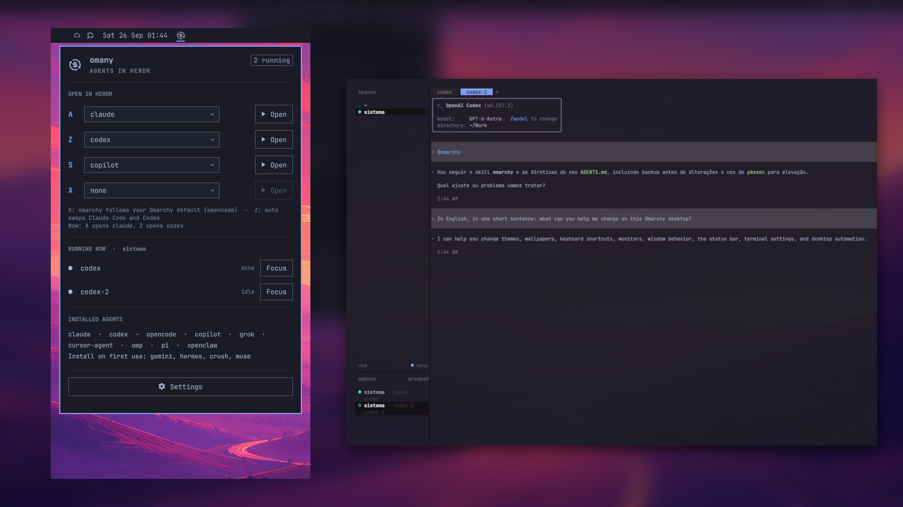
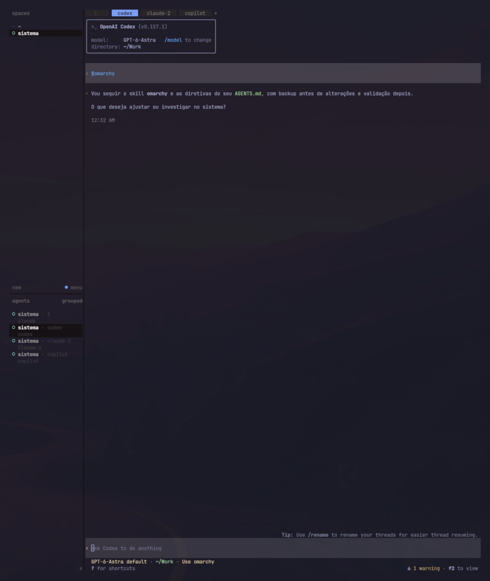

# omany

**🇺🇸 [English](#english) | 🇧🇷 [Tupiniquim](#tupiniquim)**

<a id="english"></a>

**Every AI agent opens the same way: inside [Herdr](https://github.com/herdrdev/herdr),
one tab per agent, four key slots, and the Omarchy skill loaded on the first turn.**



Omarchy's agent key opens your default agent in a loose terminal window, a new one
per press. Herdr plugins show agents that are already running, but nothing opens
them in a consistent way. omany does:

- **One place for every agent.** The first press opens Herdr (starting its server if
  needed) with a dedicated workspace; every press after that adds a tab. The window
  is never duplicated.
- **Four predictable slots.** A is your default agent, Z its counterpart (Claude Code
  ↔ Codex), S and X are free slots you fill in the panel.
- **Named agents that can talk.** Each agent gets a unique Herdr name (`claude`,
  `claude-2`, `codex`...), so agents can find and prompt each other with
  `herdr agent prompt`.
- **Omarchy-aware from the first turn.** Claude Code and Codex start with the
  `omarchy` skill loaded, when it is installed for them.
- **A panel on the bar.** Pick the agent for each slot, open any of them, see what is
  running and focus it, and see which agents are installed and which only install
  on first use.

omany is the first plugin of **omonorepo**, a series that normalizes how Omarchy
plugins fit with what you already have.

| Panel | Settings | Herdr |
|---|---|---|
|  |  |  |

## Requirements

- Omarchy with the Quattro shell (`omarchy plugin` commands)
- [Herdr](https://github.com/herdrdev/herdr) (`herdr` on `PATH`)
- `jq`
- At least one agent Herdr can drive: Claude Code, Codex, Gemini, OpenCode, Copilot,
  Grok, Cursor Agent, Hermes, OMP or Pi. OpenClaw, Crush and Muse also work,
  as a plain command in a Herdr tab.

Without Herdr, omany falls back to Omarchy's own `omarchy agent` launcher.

## Install

```bash
omarchy plugin add https://github.com/aiob3/omany.git --enable
```

Omarchy places the icon on the bar. To put it right after the clock:

```bash
omarchy bar move io.github.aiob3.omany --section center --after omarchy.clock
```

Then add the keys to `~/.config/hypr/bindings.lua`. The first line frees
Super+Ctrl+Shift+A, which Omarchy uses for its own agent launcher:

```lua
hl.unbind("SUPER + SHIFT + CTRL + A")
o.bind("SUPER + SHIFT + CTRL + A", "Agent in Herdr", "omarchy-shell shell toggle io.github.aiob3.omany")
o.bind("SUPER + CTRL + SHIFT + Z", "Other agent in Herdr", "omarchy-shell shell summon io.github.aiob3.omany '{\"agent\":\"other\"}'")
o.bind("SUPER + CTRL + SHIFT + S", "Slot S agent in Herdr", "omarchy-shell shell summon io.github.aiob3.omany '{\"slot\":\"s\"}'")
o.bind("SUPER + CTRL + SHIFT + X", "Slot X agent in Herdr", "omarchy-shell shell summon io.github.aiob3.omany '{\"slot\":\"x\"}'")
```

Check the result with `hyprctl reload && hyprctl configerrors`.

## Use

| Key | Opens |
|---|---|
| Super+Ctrl+Shift+A | slot A: your default agent |
| Super+Ctrl+Shift+Z | slot Z: its counterpart |
| Super+Ctrl+Shift+S | slot S: the agent you picked, or a notice if it is empty |
| Super+Ctrl+Shift+X | slot X: the agent you picked, or a notice if it is empty |

Click the bar icon to open the panel. To open it from a key, bind
`omarchy-shell omany toggle`; `omarchy-shell omany settings` opens it on the settings.

### Your own keys

The four slots are a starting point. Any key can open any agent, with the same rules
(Herdr, a new tab, a unique name, the skill for Claude Code and Codex):

```lua
o.bind("SUPER + CTRL + SHIFT + C", "Copilot in Herdr", "omarchy-shell shell summon io.github.aiob3.omany '{\"agent\":\"copilot\"}'")
o.bind("SUPER + CTRL + SHIFT + O", "OpenCode in Herdr", "omarchy-shell shell summon io.github.aiob3.omany '{\"agent\":\"opencode\"}'")
```

**Check the key is free first.** Omarchy ships many Super+Ctrl+Shift combinations
(G, for example, opens Google Messages); a key bound twice runs both actions. List
what is taken with `omarchy menu keybindings --print`. With Omarchy's defaults, C and
O are free with Super+Ctrl+Shift.
From a script, the same launcher runs directly:
`~/.config/omarchy/plugins/io.github.aiob3.omany/bin/omany --agent <name>`.

### omany as the base for your agents

Every agent omany opens lives in one Herdr workspace under a stable name, so they can
work together: one agent can hand a task to another with
`herdr agent prompt codex "review the last change"` and read the answer with
`herdr agent read codex`. Keys, slots and names give you a predictable layout to
orchestrate the agents you use on your system.

## Settings

In the panel, each slot has its own picker. Under **Settings**:

| Setting | Default | What it does |
|---|---|---|
| Position | center | Left, center (right after the clock) or right side of the bar |
| Herdr workspace | agents | Label of the workspace where agents open |
| Working folder | empty | Empty follows `omarchy agent` (~/Work when launched from home); `~` works |
| Load the Omarchy skill | on | Sends `/omarchy` or `$omarchy` on the first turn |

Slot A set to `omarchy` follows your Omarchy default agent; picking another agent
there changes only omany, never Omarchy's default. Slot Z set to `auto` swaps Claude
Code and Codex, and opens Claude Code for any other default.

**Reset omany to a fresh install** (two clicks) clears every omany setting through
Omarchy's own `omarchy plugin disable` and `enable`.

Without the bar, the same settings go in `~/.config/omany/config` as plain shell
assignments; anything changed in the panel wins:

```bash
OMANY_WORKSPACE="agents"   # label of the Herdr workspace
OMANY_CWD=""               # empty = same rule as `omarchy agent`
OMANY_LOAD_SKILL=true      # load the omarchy skill on the first turn
OMANY_SESSION=""           # named Herdr session (its own window); empty = the default one
OMANY_SLOT_A=""            # agent for A; empty = Omarchy default agent
OMANY_OTHER_AGENT=""       # agent for Z; empty = Claude Code <-> Codex
OMANY_SLOT_S=""            # agent for S; empty = unassigned
OMANY_SLOT_X=""            # agent for X; empty = unassigned
```

## Tested agents

Tested in real use on Omarchy with Herdr 0.8.2 (2026-09-25 and 26). "Supported"
means omany knows how to start the agent, but we have not run it yet.

| Agent | Status |
|---|---|
| Claude Code | Tested: opens in Herdr with the Omarchy skill loaded |
| Codex | Tested: opens in Herdr with the Omarchy skill loaded |
| GitHub Copilot CLI | Tested: opens in Herdr |
| Grok | Tested: opens in Herdr |
| OpenCode | Opens in Herdr; in our test OpenCode itself stopped during its own startup |
| Gemini, Cursor Agent, Hermes, OMP, Pi | Supported, not tested yet |
| OpenClaw, Crush, Muse | Supported as a plain command in a Herdr tab, not tested yet |

If you run one of the untested agents with omany, an issue with the result is welcome.

## Heads-up: unattended mode

omany starts agents with the **same flags `omarchy agent` uses**, and those skip
approval prompts: `claude --permission-mode auto`, `codex --approve-for-me`,
`gemini --yolo` and so on. That is Omarchy's default for its agent key. If you want
approvals back, start that agent yourself inside Herdr instead.

## How it works

- `bin/omany` is the launcher. It resolves the agent for the slot, focuses the Herdr
  window or opens one (`org.omarchy.herdr`), creates the workspace or a new tab with
  `herdr workspace create` / `herdr tab create`, starts the agent with
  `herdr agent start` under a unique name, and sends the skill with
  `herdr agent prompt`.
- Agents Herdr cannot recognize run with `herdr pane run` in the new tab.
- When an agent stops at a startup question (folder trust, login), omany waits up to
  a minute for you to answer, then skips the skill and sends a notification.
- `bin/omany-state` builds the panel's snapshot: slots, installed agents, and agents
  running in the workspace. It finds out whether an agent is installed by reading its
  launcher file and asking `mise where`; it never runs an agent binary, because some
  of Omarchy's launchers install the agent the first time they run.
- The bar widget and the key bindings both go through the plugin's overlay entry
  (`omarchy-shell shell toggle|summon io.github.aiob3.omany`).

## What it writes

| Where | What | When |
|---|---|---|
| `~/.config/omarchy/shell.json` | omany's own entry on the bar and its settings, through `omarchy bar set` | when you change a setting in the panel |
| bar placement | moves only omany's icon, through `omarchy bar move` | when you change Position |
| `~/.local/state/omany.log` | one line per launch and any error | every launch |
| `~/.local/state/omany/` | copies of `shell.json` | before a Reset |
| `~/.config/omany/config.bak-*` | your manual config, set aside | on Reset, only if it exists |

omany never edits `bindings.lua`, never changes Omarchy's default agent, and never
rearranges other widgets.

## What it deliberately does not do

- It does not monitor agents across machines or show their usage. Herdr plugins such
  as `jankeesvw.herdr` and `njpatel.omaherdr` already do that well, and they work
  alongside omany.
- It does not install agents. The panel tells you which ones only install on first use.
- It does not stop or kill agents; close their Herdr tab as usual.

## Troubleshooting

- **Nothing happens on a key:** check `~/.local/state/omany.log`; every launch and
  error is there.
- **A slot key shows "no agent assigned":** pick an agent for that slot in the panel.
- **An agent opens but the skill is not sent:** it was waiting at a startup question;
  answer it, then send `/omarchy` (Claude Code) or `$omarchy` (Codex) yourself.
- **The icon does not show after an update:** run `omarchy restart shell`.
- **Agents open in the wrong workspace:** check **Herdr workspace** in the panel's
  settings; a Reset brings it back to `agents`.

## Uninstall

```bash
omarchy plugin remove io.github.aiob3.omany
rm -rf ~/.config/omany ~/.local/state/omany ~/.local/state/omany.log
```

Then remove the binding lines you added. Omarchy's own agent key comes back.

## License

MIT

## Credits

The bar icon is `exchange-dollar-line` from [Remix Icon](https://remixicon.com),
licensed under the Apache License 2.0.

---

<a id="tupiniquim"></a>

## 🇧🇷 Tupiniquim

**Todo agente de IA abre do mesmo jeito: dentro do [Herdr](https://github.com/herdrdev/herdr),
uma aba por agente, quatro vagas no teclado e o skill do Omarchy carregado no primeiro turno.**

Feito no Brasil. O omany é o primeiro plugin do **omonorepo**, uma série que
normatiza como os plugins do Omarchy convivem com o que você já tem instalado.

A tecla de agente do Omarchy abre o seu agente padrão numa janela de terminal solta,
uma nova a cada toque. Os plugins do Herdr mostram agentes que já estão rodando, mas
nada os abre de um jeito uniforme. O omany faz isso:

- **Um lugar para todos os agentes.** O primeiro toque abre o Herdr (e o servidor
  dele, se preciso) com um workspace próprio; cada toque seguinte abre uma aba. A
  janela nunca duplica.
- **Quatro vagas previsíveis.** A é o seu agente padrão, Z o par dele (Claude Code ↔
  Codex), S e X são vagas livres que você preenche no painel.
- **Agentes com nome, que conversam entre si.** Cada agente recebe um nome único no
  Herdr (`claude`, `claude-2`, `codex`...), e um pode mandar tarefa ao outro com
  `herdr agent prompt`.
- **O Omarchy no contexto desde o primeiro turno.** Claude Code e Codex já começam com
  o skill `omarchy` carregado, quando ele está instalado.
- **Um painel na barra.** Escolha o agente de cada vaga, abra qualquer um, veja o que
  está rodando e foque nele, e veja quais agentes estão instalados e quais só
  instalam no primeiro uso.

### Instalar

```bash
omarchy plugin add https://github.com/aiob3/omany.git --enable
omarchy bar move io.github.aiob3.omany --section center --after omarchy.clock   # opcional: ícone depois do relógio
```

As teclas vão no `~/.config/hypr/bindings.lua`, com as mesmas linhas da seção
[Install](#install) em inglês. Depois, `hyprctl reload && hyprctl configerrors`.

| Tecla | Abre |
|---|---|
| Super+Ctrl+Shift+A | vaga A: o seu agente padrão |
| Super+Ctrl+Shift+Z | vaga Z: o par dele |
| Super+Ctrl+Shift+S / X | vagas S e X: o agente que você escolheu, ou um aviso se estiver vazia |

### Suas próprias teclas

As quatro vagas são um ponto de partida. Qualquer tecla abre qualquer agente, com as
mesmas regras:

```lua
o.bind("SUPER + CTRL + SHIFT + C", "Copilot no Herdr", "omarchy-shell shell summon io.github.aiob3.omany '{\"agent\":\"copilot\"}'")
```

**Confira antes se a tecla está livre** (`omarchy menu keybindings --print`): o Omarchy
já usa várias combinações com Super+Ctrl+Shift (a G abre o Google Messages), e uma
tecla com duas ações executa as duas.

Como todo agente aberto pelo omany fica num mesmo workspace do Herdr com um nome
estável, eles trabalham juntos: um passa tarefa ao outro com
`herdr agent prompt codex "revise a última mudança"`. O omany vira a base para
orquestrar os agentes do seu sistema.

### Agentes homologados

| Agente | Situação |
|---|---|
| Claude Code, Codex | Testados: abrem no Herdr com o skill do Omarchy |
| GitHub Copilot CLI, Grok | Testados: abrem no Herdr |
| OpenCode | Abre no Herdr; no nosso teste o próprio OpenCode parou na inicialização dele |
| Gemini, Cursor Agent, Hermes, OMP, Pi, OpenClaw, Crush, Muse | Suportados, ainda não testados |

### Atenção: modo sem aprovação

O omany abre os agentes com as **mesmas opções que o `omarchy agent` usa**, e elas
pulam as confirmações (`claude --permission-mode auto`, `codex --approve-for-me`,
`gemini --yolo`...). Se quiser as confirmações de volta, abra esse agente você mesmo
dentro do Herdr.

### O que ele grava

Só as próprias configurações (pelo `omarchy bar set`, quando você muda algo no
painel), a posição do próprio ícone (quando você muda Position), um log em
`~/.local/state/omany.log` e cópias do `shell.json` antes de um Reset. Nunca mexe no
`bindings.lua`, nunca troca o agente padrão do Omarchy e nunca reorganiza outros
widgets. O detalhe está nas seções [How it works](#how-it-works) e
[What it writes](#what-it-writes).

### Remover

```bash
omarchy plugin remove io.github.aiob3.omany
rm -rf ~/.config/omany ~/.local/state/omany ~/.local/state/omany.log
```

Depois, apague as linhas de tecla que você adicionou.
